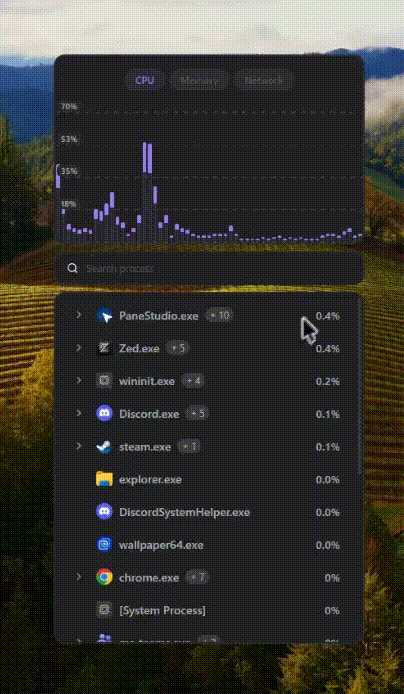
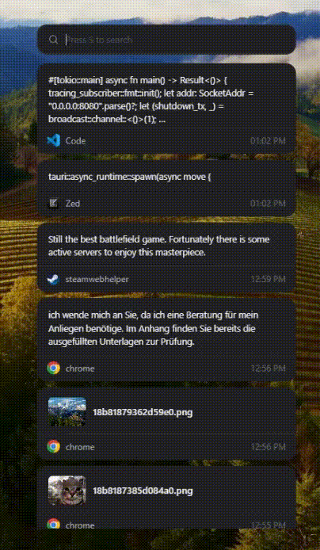
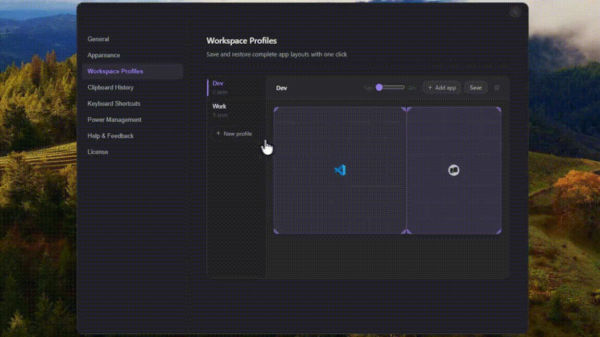
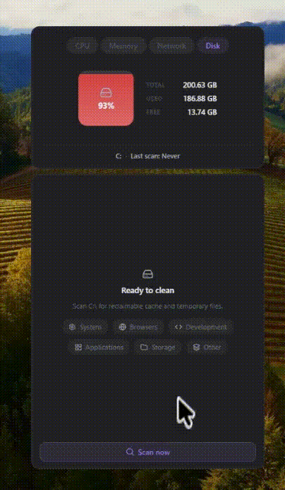

# Kova

**Your workspace, one menu away.**

Kova is a desktop utility that lives in your system tray and puts a few useful tools in one place: system monitoring, clipboard history, workspace profiles, disk cleanup, and brightness control.

Instead of having a separate app for each of these things, Kova keeps them together in one small menu.

## ✨ Features
<table> <tr> <td width="40%" valign="top">
System Monitor

See CPU, memory, disk, and network usage, including usage by individual processes.

</td>
<td width="60%" align="center">
  
</td>

</tr> <tr> <td width="40%" valign="top">
Clipboard History

Keep a searchable history of copied text and images. Search, preview, copy, or paste previous items when you need them.

</td>
<td width="60%" align="center">
  
</td>

</tr> <tr> <td width="40%" valign="top">
Workspace Profiles

Save window layouts and restore them when switching between different work setups.

</td>
<td width="60%" align="center">
  
</td>

</tr> <tr> <td width="40%" valign="top">
Disk Cleanup

Find browser caches, development artifacts, large files, and other files taking up space.

</td>
<td width="60%" align="center">
  
</td>

</tr> </table>

### Brightness Control

Change your display brightness directly from Kova.

### Global Shortcuts

Open Kova and its features using configurable keyboard shortcuts.

### Auto Updates

Keep Kova up to date with built-in signed updates.

## Why Kova?

There are plenty of small utilities that solve individual problems.

Kova is an attempt to put some of them together without turning the desktop into a collection of separate apps and menus.

It stays in the system tray until you need it.

## 🖥️ Supported Platforms

Kova currently supports:

* Windows
* macOS

Linux support is planned.

## 🚀 Getting Started

Download the latest version from the [website](https://appkova.com/) page.

Kova runs in the system tray. From there you can access its tools or configure keyboard shortcuts for quick access.

## 🤝 Contributing

We welcome contributions!

You can help by:

* Reporting bugs
* Suggesting features
* Improving the UI
* Improving platform support
* Fixing issues
* Improving documentation

If you find a bug or have an idea, open an [issue](../../issues).
